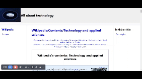

# Report: Web Development Project Recreating Wikipedia with a Modern Layout. Added APIs.

## Introduction

This web development project aimed to create a dynamic webpage that fetches random Wikipedia articles related to technology. The primary goal was to implement JavaScript functions to make asynchronous requests to the Wikipedia API and dynamically update the webpage content with random articles and images.

## Methods

The project utilized HTML, CSS, and JavaScript to achieve the desired functionality. The main steps included:

1. **Fetching Random Article Titles:** Used the Wikipedia API to obtain a list of random article titles related to technology.

2. **Fetching Article Content:** Utilized the obtained titles to make additional API requests for detailed article content, including text and images.

3. **Displaying Content:** Dynamically updated the webpage's main section with the fetched content, providing users with information about random technology-related topics.

4. **Unsplash Integration:** Incorporated Unsplash to display a random technology-related image as the logo.

## Results

The implemented webpage successfully achieves its objectives. Upon loading, the webpage fetches a random technology-related Wikipedia article, displays its content, and showcases a Unsplash image as the logo.

## Conclusion

This project demonstrates the capability of utilizing web technologies to create dynamic and engaging content. The integration of Wikipedia API and Unsplash enhances the user experience by providing informative and visually appealing random content related to technology.

---

### Study Case: Exploring FIBA Under-19 Women's Basketball World Cup

As a study case, the webpage randomly fetched information about the [FIBA Under-19 Women's Basketball World Cup](https://en.wikipedia.org/wiki/FIBA_Under-19_Women%27s_Basketball_World_Cup). The content included details about the tournament, its history, and relevant images, showcasing the versatility of the developed system.

---
